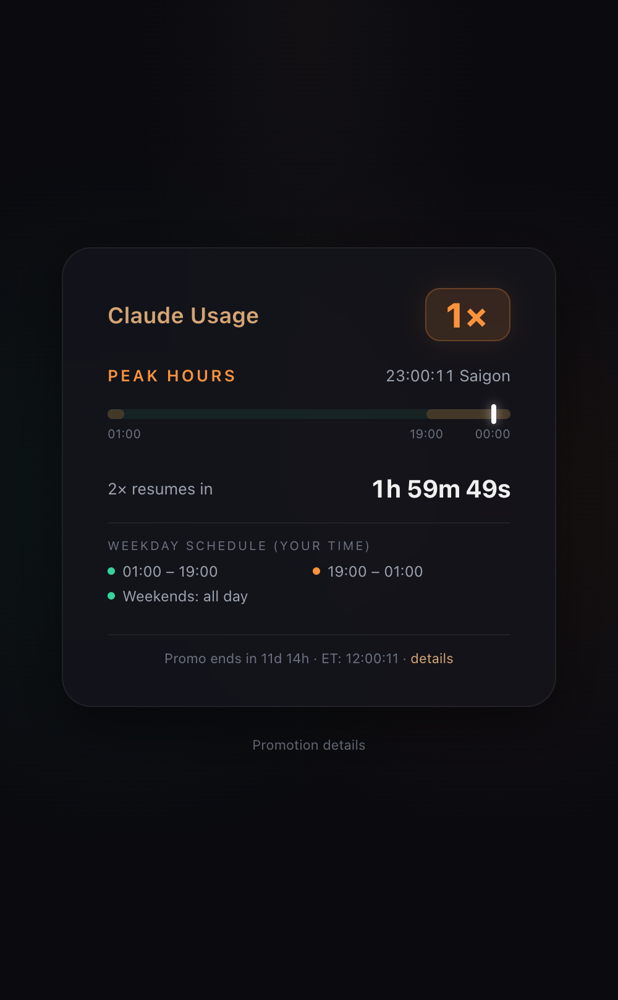

# Claude Off-Peak

Track Claude's March 2026 double usage promotion in your browser. Auto-detects your timezone.

**Live:** [sondh5.github.io/claude-offpeak](https://sondh5.github.io/claude-offpeak)

## Features

- **2× / 1× badge** — green for off-peak (double usage), orange for peak
- **Live clock** in your local timezone with countdown to next status change
- **24h timeline bar** with peak window converted to your timezone
- **Weekend detection** — no peak hours on weekends
- **Promotion countdown** — days remaining until March 27

## Promotion rules

| Period | Hours (ET) | Usage |
|--------|-----------|-------|
| Off-peak | Before 8 AM, after 2 PM (weekdays) | 2× |
| Off-peak | All day (weekends) | 2× |
| Peak | 8 AM – 2 PM (weekdays) | 1× |

Active: March 13–27, 2026. Eligible: Free, Pro, Max, Team plans.

[Promotion details](https://support.claude.com/en/articles/14063676-claude-march-2026-usage-promotion)

## Inspired by

- [claudethrottle.com](https://www.claudethrottle.com/)
